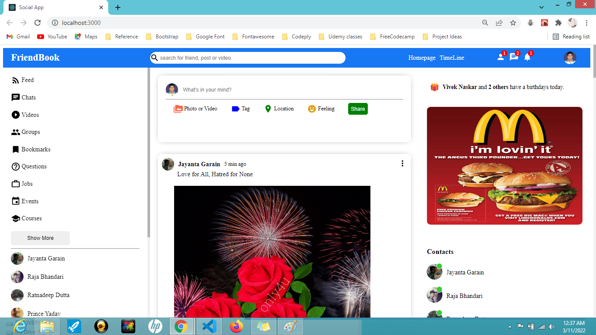

# Screenshot

# Social App
This is a social-app a facebook clone made using React.js with bootstrap.

# Installation
These are the requirements should be installed in your system
- VS Code
- Node.js

# How to setup node.js on your system?
- Move to: [link](https://nodejs.org/en/download/) choose the operating system as per your machine and start downloading and setup by clicking recommended settings in the installation wizard.

# How to set up Project locally?
- Open Hyper/Window powershell
- [install ReactJS package](https://reactjs.org/docs/create-a-new-react-app.html)
- npm install create-react-app social-app
- npm start
